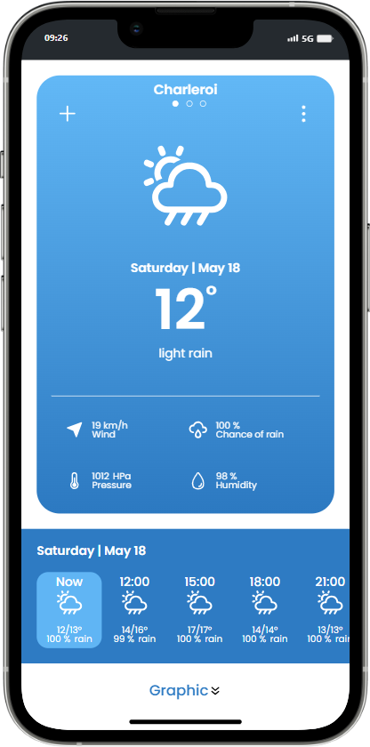
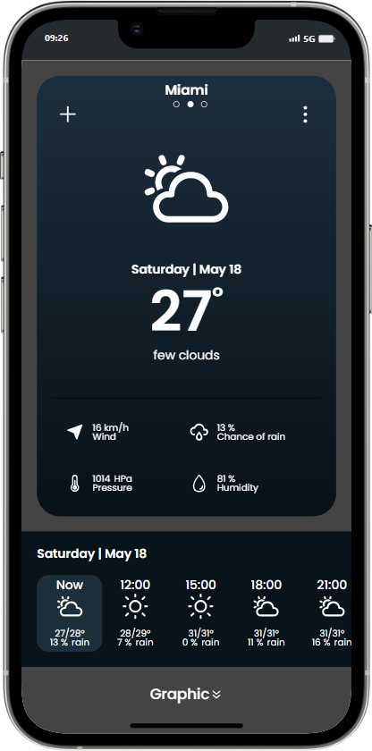
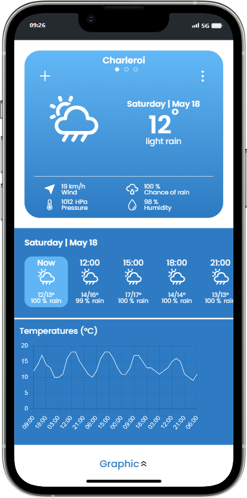
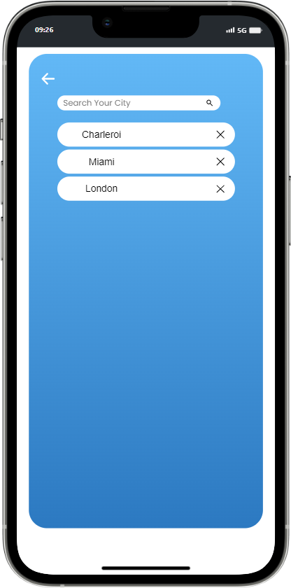

# WeatherApp

## Introduction
WeatherApp is a weather application that allows users to check current weather conditions and short- and long-term forecasts for any location worldwide.

## Main Features
- **Display of Current Weather Conditions:** Temperature, humidity, wind speed, etc.
- **Short-term and Long-term Weather Forecasts:** Forecasts for the next 24 hours and the next 7 days.
- **Save Favorite Locations:** Ability to save favorite locations for quick access.
- **Temperature Charts:** Visual representation of temperature trends over a selected period.

## Technologies Used
- **HTML:** For structuring the content of the app.
- **CSS (Sass):** For styling the app, using Sass for more advanced CSS features.
- **JavaScript:** For interactivity and functionality.
  - **DOM Manipulation:** To dynamically update the user interface.
  - **Fetch API:** To retrieve weather data from the weather API.
  - **LocalStorage:** To save user preferences and favorite locations.

## APIs Used

- **[OpenWeatherMap API](https://openweathermap.org/appid):** Used to fetch current weather conditions and forecasts.
- **[Unsplash API](https://unsplash.com/developers):** Used to fetch dynamic background images based on the current weather conditions.

## Design

The design of WeatherApp was created using Figma. You can view the design and prototype [here](https://www.figma.com/design/mWP6f9rS0jNn6fATkMbFLN/Weather-Mobile-App-Design-(Community)?node-id=19-3463&t=BWvGIFACbL55FzyF-0).

## Preview

 |  |  | 
:--------------------------------------:|:-------------------------------------:|:-----------------------------:|:-----------------------------------:
Light Mode                              | Dark Mode                             | Temperature Chart             | Add City

## Liens Utiles

- **GitHub Repository:** [https://github.com/ludoviclacroix82/Weather-App](https://github.com/ludoviclacroix82/Weather-App)
- **GitHub Pages:** [https://ludoviclacroix82.github.io/Weather-App/](https://ludoviclacroix82.github.io/Weather-App/)
- **Mission sur GitHub:** [https://github.com/becodeorg/CRL-KELLER-7/tree/main/2.PROJECTS/6.Weather-app](https://github.com/becodeorg/CRL-KELLER-7/tree/main/2.PROJECTS/6.Weather-app)

## Additional Features

### 1. Integration of Country Image via Unsplash API:
- Use the Unsplash API to search for images based on the selected country or city by the user.
- When fetching weather data from the OpenWeatherMap API, use the country or city name to perform an image search on Unsplash.
- Integrate this image into your application's user interface to display a visual representation of the country or city.

### 2. Setting Zone Implementation:
- Create a user interface to allow users to set their preferences and settings.
- This settings zone can include options such as choosing the temperature unit (Celsius or Fahrenheit), the language of the application, displaying time in 12-hour or 24-hour format, etc.
- Use LocalStorage to store user preferences so that they persist between sessions.

### 3. Responsive Design for Desktop Devices:
- Optimize the layout and features to adapt to different screen resolutions and window sizes on desktop computers.

## License
This project is not accompanied by a specific license and is therefore considered to be under copyright by default. You are free to view, modify, and distribute the code of this project for non-commercial purposes. However, please note that you do not have explicit permission to use this code in commercial or proprietary projects. If you wish to use this code in such circumstances, please contact me to obtain their authorization.

